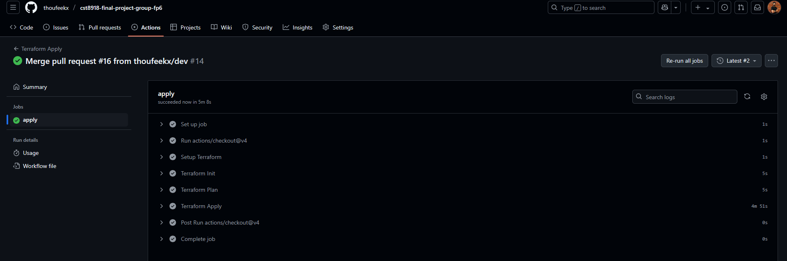

# CST8918 Final Project - FP 6

## Team Members

- Thoufeek Baber [041166788]
- Akhil Jose [041171055]
- Stefeena Vellachanil Benny [041154501]
- Shiva Reddy [041154500]

## Project Overview

This project implements Infrastructure as Code (IaC) using Terraform to deploy the Remix Weather Application on Azure Kubernetes Service (AKS). The infrastructure includes:

- Azure Container Registry (ACR)
- Azure Kubernetes Service (AKS) clusters for test and production environments
- Azure Cache for Redis for caching weather data
- Network infrastructure with proper segmentation

## Screen shots

- Images shows the deployed website

- Images shows the successfull workflow runs

- Images shows the Workflow of Validate

- Images shows the Workflow of Apply

- Images shows the Deploy Workflow

## Infrastructure Components

### Network Infrastructure
- Resource Group: `fp6-network-rg`
- Virtual Network with IP address space: 10.0.0.0/14
- Subnets:
  - prod: 10.0.0.0/16
  - test: 10.1.0.0/16
  - dev: 10.2.0.0/16
  - admin: 10.3.0.0/16

### Kubernetes Clusters
- Test Environment: 1 node AKS cluster
- Production Environment: 1-3 node AKS cluster

## **Phase 4: Azure Kubernetes Service (AKS) Infrastructure**

In this phase, the project team focused on provisioning and configuring Kubernetes clusters using Azure Kubernetes Service (AKS) to support both test and production workloads. The configuration aligns with best practices for cost-effective and scalable infrastructure suitable for a microservices-based deployment model.

### 4.1 AKS Module Creation

A reusable Terraform module was developed to define the baseline configuration for AKS clusters. This module ensures consistent infrastructure provisioning across different environments.

### 4.2 Test Environment AKS Configuration

A lightweight AKS cluster was provisioned for the test environment to support pre-production deployments and validation. The key configuration elements included:

- **Node Count**: 1 node  
- **VM Size**: Standard B2s (2 vCPU, 4 GiB RAM)  
- **Kubernetes Version**: v1.32  
- **Use Case**: Suitable for low-traffic, staging, and test workloads.

### 4.3 Production Environment AKS Configuration

To support production workloads with potential for scaling, the AKS cluster was provisioned with autoscaling capabilities. The configuration for the production environment included:

- **Node Pool**: 1–3 nodes, with autoscaling enabled  
- **VM Size**: Standard B2s  
- **Kubernetes Version**: v1.32  
- **Use Case**: Supports production-level traffic with elasticity based on workload demands.

### 4.4 Azure Container Registry (ACR) Setup

A centralized Azure Container Registry (ACR) was created to store and manage container images securely. This ACR acts as the single source of truth for Docker images built during the CI/CD pipeline execution.

### 4.5 AKS-ACR Integration

To ensure seamless image pulls during deployments, the AKS clusters (both test and production) were integrated with the ACR using Azure-managed identities and role-based access control (RBAC). This integration allows AKS to securely pull container images without requiring manual secrets or credentials.

---

## **Phase 5: Application Infrastructure**

This phase involved the creation of infrastructure components required to support application runtime and caching, along with the deployment of the Remix Weather Application into the Kubernetes environment.

### 5.1 Application Module Creation

A separate Terraform module was created to encapsulate application-specific infrastructure such as Azure Cache for Redis and Kubernetes objects. This promotes reusability and clean separation of infrastructure concerns.

### 5.2 Azure Cache for Redis Setup

To improve application performance through fast, in-memory caching, Redis instances were provisioned in both environments:

- **Test Environment**: Azure Cache for Redis configured with basic settings suitable for non-critical workloads.  
- **Production Environment**: Azure Cache for Redis configured with higher availability and performance parameters to support live application traffic.

### 5.3 Kubernetes Configuration

The following components were configured using Terraform scripts and Kubernetes manifests:

- **Deployments**: Defined for the Remix Weather Application backend and frontend services, enabling scalable and fault-tolerant containerized workloads.
- **Services**: Kubernetes services (ClusterIP, LoadBalancer) were configured to expose application components internally and externally as needed.

### 5.4 Application Import and Configuration

The Remix Weather Application source code was imported into the deployment repository. Application-specific settings such as environment variables, secrets, and port configurations were applied through Kubernetes ConfigMaps and Secrets.

---

## **Phase 6: CI/CD Pipeline Implementation**

The Continuous Integration and Continuous Deployment (CI/CD) workflows were developed using GitHub Actions in combination with Terraform and Docker. This phase ensured reliable and automated infrastructure and application delivery pipelines.

### 6.1 Terraform Validation Workflow

An initial CI pipeline was created to validate Terraform code syntax, provider versions, and formatting consistency. This step ensures early detection of infrastructure-as-code issues on each commit.

✅ **Status**: Completed

### 6.2 Federated Identity Setup for GitHub Actions

Azure AD federated identities were configured to enable GitHub Actions workflows to authenticate securely with Azure without using service principal secrets. This step involved:

- Creating Azure AD Applications (read-only and read-write)  
- Assigning appropriate roles (e.g., Contributor)  
- Setting up federated credentials for GitHub Actions OIDC tokens

### 6.3 GitHub Actions Workflows

The following CI/CD workflows were designed and are in progress for implementation:

- **Static Code Analysis**  
  Trigger: On push to any branch  
  Description: Lints Terraform and application code using tools like `tflint`, `eslint`, etc.

- **Terraform Plan & Linting**  
  Trigger: On Pull Request (PR) to main  
  Description: Executes `terraform plan` and validates code changes before merging.

- **Terraform Apply**  
  Trigger: On merge to main  
  Description: Deploys approved infrastructure changes to Azure.

- **Docker Build & Push**  
  Trigger: On PR with app-related changes  
  Description: Builds application containers and pushes images to ACR.

- **Application Deployment to Test**  
  Trigger: On PR with app changes  
  Description: Deploys the application to the test AKS environment for validation.

- **Application Deployment to Production**  
  Trigger: On merge to main  
  Description: Triggers production deployment for approved changes.

## Application Deployment

The Remix Weather Application is deployed to both test and production environments. The application is accessible at:
- Test Environment: http://74.179.242.115/

## GitHub Actions Workflows

The project includes several automated workflows:
- Terraform static code analysis
- Terraform plan and validation
- Terraform apply
- Docker image building and pushing
- Application deployment to test/prod environments

## Screenshots

## Clean Up

After submission, please delete all Azure resources to avoid additional charges.

## Access Instructions

1. The application is deployed to Azure Kubernetes Service
2. Access the application at http://74.179.242.115/
3. View the weather data for Algonquin College, Woodroffe Campus
